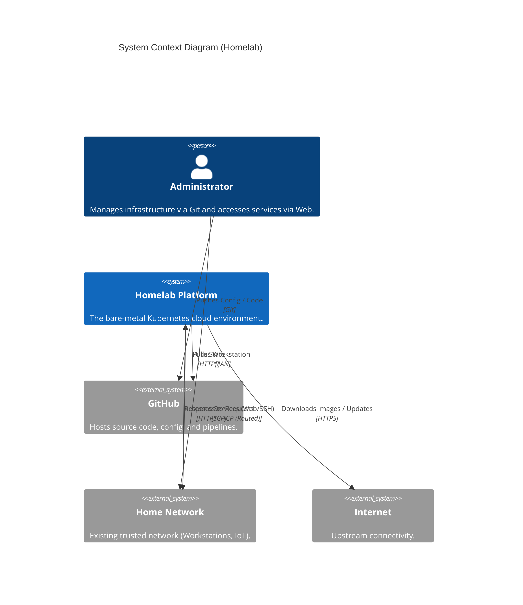

# 03. Context and Scope

## Business Context
**Goal**: To provide a realistic, isolated, and scalable infrastructure environment for Platform Engineering research and personal services hosting.

**Primary User**: The Administrator (Josh).
**Interaction Models**:
1.  **GitOps Workflow**: User pushes code to GitHub -> Argo CD synchronizes state.
2.  **Direct Access**: User accesses hosted web services (Grafana, Argo UI, Applications) via browser on the Home Network.
3.  **Bootstrap**: User manually initiates the "Genesis" sequence (rare event).

## Technical Context
The Lab System is designed as a "Black Box" that sits adjacent to the Home Network. It interacts with the outside world through strictly defined interfaces.

### System Context Diagram

### External Interfaces

| Interface | Type | Description |
| :--- | :--- | :--- |
| **Home -> Lab (Data)** | **IPv4 Routing** | Traffic from Home Workstations (192.168.0.0/24) is routed via the Transit Link to Lab VIPs (10.10.x.x). **Firewalled ALLOW**. |
| **Lab -> Home (Data)** | **IPv4 Routing** | Lab nodes attempting to initiate connections to Home devices. **Firewalled DROP** (except specific replies). |
| **Lab -> Internet** | **NAT** | Lab nodes access the internet via the Gateway (VP6630) which performs NAT. |
| **GitOps Sync** | **HTTPS** | The Lab (Argo CD) polls GitHub repositories to synchronize state. |

### Scope Definition

| Zone | Status | Description |
| :--- | :--- | :--- |
| **Infrastructure** | **In Scope** | Hardware, Provisioning (Tinkerbell), Hypervisor (Harvester), Kubernetes (Talos). |
| **Platform Services** | **In Scope** | Identity (Zitadel), Secrets (OpenBAO), Observability, Ingress, Cert-Manager. |
| **Home LAN** | **Out of Scope** | Wi-Fi Access Points, Smart Home Hubs, IoT devices, Corporate Laptops. |
