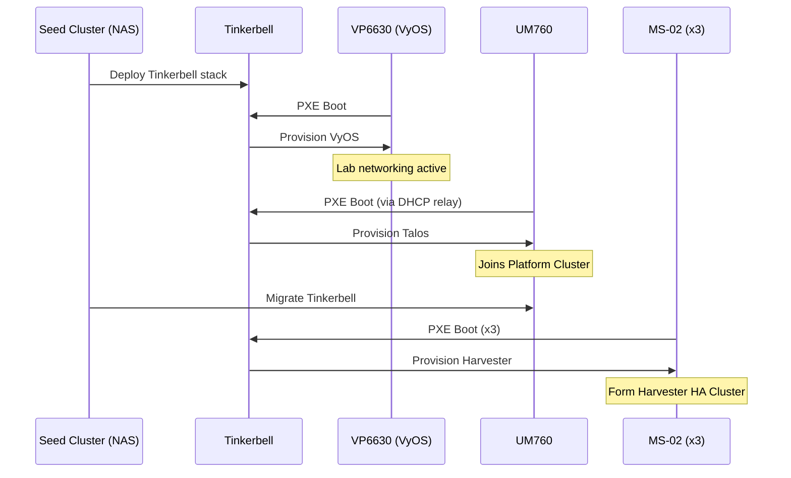

# 05. Building Block: Tinkerbell Provisioning

## Overview
**Tinkerbell** is the bare-metal provisioning engine that solves the "chicken and egg" problem: how do you install an operating system on a machine that has no operating system? It provides PXE boot services, metadata, and workflow orchestration to transform raw hardware into configured nodes.

## Role in the Architecture

Tinkerbell handles **Day Zero** operations — the initial bootstrap of physical machines before they can participate in the cluster:

| Target | What Tinkerbell Installs | Result |
|:---|:---|:---|
| **VP6630** | VyOS (Packer-built image) | Lab router with VLANs and DHCP relay |
| **UM760** | Talos Linux | Node joins the Platform Cluster |
| **MS-02 (x3)** | Harvester OS | Nodes join the Harvester HCI cluster |

After initial provisioning, Tinkerbell's role is complete. Ongoing lifecycle management is handled by VyOS CI/CD (for router config), Harvester (for HCI), and CAPI (for Kubernetes clusters).

## Components

Tinkerbell is composed of several microservices, deployed as containers:

| Component | Purpose |
|:---|:---|
| **Smee** | DHCP server and PXE boot handler. Directs booting machines to the iPXE script. |
| **Hegel** | Metadata service. Provides hardware-specific data (IPs, hostnames) to provisioning workflows. |
| **Tink Server** | Workflow engine API. Stores hardware definitions and workflow state. |
| **Tink Worker** | Runs on the target machine (in-memory). Executes workflow actions. |
| **Hook** | The in-memory Linux environment (LinuxKit) that boots on target hardware and runs Tink Worker. |

### Architecture Diagram
```
┌─────────────────────────────────────────────────────────────────┐
│                     Seed Cluster (NAS/UM760)                    │
│  ┌─────────┐  ┌─────────┐  ┌─────────────┐  ┌───────────────┐   │
│  │  Smee   │  │  Hegel  │  │ Tink Server │  │ Image Server  │   │
│  │ (DHCP)  │  │ (Meta)  │  │ (Workflows) │  │   (HTTP)      │   │
│  └────┬────┘  └────┬────┘  └──────┬──────┘  └───────┬───────┘   │
└───────┼────────────┼──────────────┼─────────────────┼───────────┘
        │            │              │                 │
        │ DHCP/PXE   │ Metadata     │ Workflow API    │ OS Images
        ▼            ▼              ▼                 ▼
┌─────────────────────────────────────────────────────────────────┐
│                      Target Hardware (MS-02)                    │
│  ┌──────────────────────────────────────────────────────────┐   │
│  │                   Hook (In-Memory OS)                    │   │
│  │  ┌─────────────┐                                         │   │
│  │  │ Tink Worker │ ──▶ Executes: write-disk, reboot, etc.  │   │
│  │  └─────────────┘                                         │   │
│  └──────────────────────────────────────────────────────────┘   │
└─────────────────────────────────────────────────────────────────┘
```

## Networking

Tinkerbell operates on **VLAN 20 (LAB_PROV)** — the Provisioning network:

| Attribute | Value |
|:---|:---|
| **Subnet** | `10.10.20.0/24` |
| **DHCP Server** | Smee (Tinkerbell) |
| **Gateway** | `10.10.20.1` (VyOS) |
| **Native VLAN** | Yes — bare metal boots untagged on this VLAN |

### Why a Dedicated VLAN?
- **Isolation**: PXE/DHCP traffic is "noisy" and should not interfere with production workloads
- **Security**: Provisioning is a sensitive phase; limiting scope reduces attack surface
- **Compatibility**: vPro/AMT on MS-02 only works reliably on the 2.5GbE ports (Split Plane constraint)

## Workflow: Provisioning a Node

1. **Power On**: Node boots via vPro/AMT (or manual power button)
2. **PXE Boot**: NIC broadcasts DHCP request on VLAN 20
3. **Smee Responds**: Provides IP and iPXE script URL
4. **Hook Boots**: Target downloads and boots the Hook environment (LinuxKit)
5. **Tink Worker Starts**: Worker contacts Tink Server, receives workflow
6. **Workflow Executes**: Actions run (partition disk, write OS image, configure)
7. **Reboot**: Node reboots into the installed OS (Harvester or Talos)

### Hardware Registration
Before a node can be provisioned, it must be registered in Tink Server with:
- **MAC Address**: Identifies the machine on the network
- **IP Assignment**: What IP to give via DHCP
- **Workflow Template**: Which provisioning workflow to execute

This registration is stored as **Hardware** and **Template** CRDs when Tinkerbell runs on Kubernetes.

## Integration with Genesis Bootstrap

During the [Genesis bootstrap sequence](../06_runtime_view.md), Tinkerbell is deployed on the temporary **Seed Cluster** (Synology NAS):



After the MS-02 nodes are provisioned with Harvester, Tinkerbell's primary mission is complete. It remains available for disaster recovery (re-provisioning failed nodes). VyOS configuration changes after initial provisioning are managed via the Ansible CI/CD pipeline.

## Operational Notes

### Re-Provisioning a Node
To wipe and re-provision a node:
1. Delete the Hardware CRD to clear state
2. Re-create Hardware CRD with desired workflow
3. Trigger PXE boot via vPro/AMT or BIOS settings

### Image Storage

OS images (VyOS raw image, Harvester ISO, Talos raw image) are served via HTTP. The architecture uses a **NFS + HTTP container** pattern:

```
┌─────────────┐      NFS       ┌──────────────────────────────────────┐
│ Synology NAS│ ─────────────▶ │ Seed Cluster                         │
│  (Storage)  │                │  ┌────────────────┐  ┌─────────────┐ │
│             │                │  │  NFS PV Mount  │──│ nginx (HTTP)│ │
└─────────────┘                │  └────────────────┘  └──────┬──────┘ │
                               └─────────────────────────────┼────────┘
                                                             │
                                                        VLAN 20
                                                             │
                                                             ▼
                                                    Target Hardware
```

| Component | Details |
|:---|:---|
| **Storage** | Synology NAS exports `/volume1/images` via NFS |
| **Mount** | Seed Cluster mounts NFS as a PersistentVolume |
| **HTTP Server** | nginx container serves images on VLAN 20 |

> [!NOTE]
> This design keeps the NAS **off LAB_PROV (VLAN 20)**. The NAS only needs connectivity to the Platform/Management network, while the HTTP server running on the Seed Cluster handles the provisioning-facing traffic.
