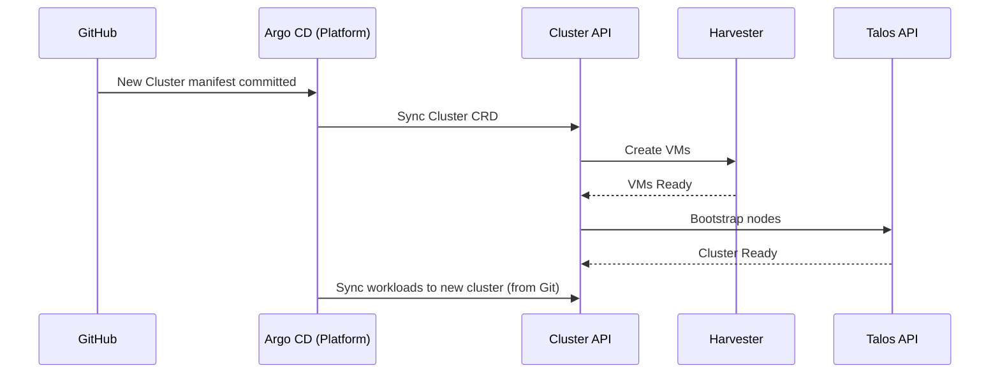

# 05. Building Block: Downstream Clusters

## Overview
**Downstream Clusters** are ephemeral, workload-focused Kubernetes clusters where applications actually run. Unlike the permanent Platform Cluster, these are treated as **cattle** — easily created, modified, and destroyed via GitOps.

> The Platform Cluster is the "factory"; Downstream Clusters are the "products".

## Role in the Architecture

| Aspect | Description |
|:---|:---|
| **Purpose** | Host application workloads (media, games, dev environments, etc.) |
| **Lifecycle** | Managed by Cluster API on the Platform Cluster |
| **Infrastructure** | VMs running on Harvester HCI |
| **Operating System** | Talos Linux (immutable, API-driven) |
| **Configuration** | Defined in Git as **Crossplane Claims**, deployed via Argo CD |

## Cluster Topology

Each downstream cluster follows a standard template:

| Component | Default Configuration |
|:---|:---|
| **Control Plane** | 1 or 3 nodes (depending on criticality) |
| **Workers** | Variable (scaled via MachineDeployment) |
| **Node Size** | 4 vCPU, 8GB RAM (adjustable per cluster) |
| **CNI** | Cilium (with BGP for LoadBalancer services) |
| **Storage** | Harvester CSI (PVs backed by Longhorn) |

### Example: Media Cluster
```yaml
Cluster: media
  ├── Control Plane: 1 node (non-critical workloads)
  ├── Workers: 2 nodes
  └── Workloads:
      ├── Plex
      ├── Jellyfin
      └── *arr stack
```

### Example: Dev Cluster
```yaml
Cluster: dev
  ├── Control Plane: 1 node
  ├── Workers: 1-3 nodes (auto-scaled)
  └── Workloads:
      ├── Development environments
      └── CI/CD runners
```

## Networking

Downstream clusters operate on **VLAN 40 (LAB_CLUSTER)**:

| Attribute | Value |
|:---|:---|
| **Subnet** | `10.10.40.0/24` |
| **Gateway** | `10.10.40.1` (VyOS) |
| **DHCP** | VyOS (dynamic for worker nodes) |
| **CNI** | Cilium |
| **LoadBalancer** | Cilium BGP → VyOS (VIPs from `10.10.50.0/24`) |

### Service Exposure
Services of type `LoadBalancer` receive VIPs from VLAN 50 via BGP:

```
┌─────────────────┐         ┌─────────────────┐
│  Home Network   │         │     VyOS        │
│  192.168.0.x    │◀───────▶│  (BGP Router)   │
└─────────────────┘         └────────┬────────┘
                                     │ ECMP Routes
                                     ▼
                            ┌─────────────────┐
                            │ Downstream      │
                            │ Cluster Nodes   │
                            │ (Cilium BGP)    │
                            └─────────────────┘
```

## Provisioning Workflow

Downstream clusters are created declaratively via CAPI manifests stored in Git:



### Cluster Definition (Simplified)
```yaml
apiVersion: cluster.x-k8s.io/v1beta1
kind: Cluster
metadata:
  name: media
  namespace: clusters
spec:
  controlPlaneRef:
    kind: TalosControlPlane
    name: media-cp
  infrastructureRef:
    kind: HarvesterCluster
    name: media
---
apiVersion: infrastructure.cluster.x-k8s.io/v1alpha1
kind: HarvesterCluster
metadata:
  name: media
spec:
  targetNamespace: default
  # VM network, storage class, etc.
```

## Workload Management

### GitOps Structure
Each downstream cluster has its own Argo CD `ApplicationSet` or dedicated `Application` that points to a cluster-specific path in the Git repo:

```
repo/
├── clusters/
│   ├── media/
│   │   ├── apps/
│   │   │   ├── plex.yaml
│   │   │   └── jellyfin.yaml
│   │   └── kustomization.yaml
│   └── dev/
│       ├── apps/
│       └── kustomization.yaml
└── platform/
    └── ...
```

### Dynamic Discovery Pattern
The Platform Cluster's Argo CD uses an `ApplicationSet` with a Git directory generator to automatically discover and deploy workloads:

1. Creates the downstream cluster (CAPI resources)
2. Installs Argo CD Agent on the downstream cluster
3. ApplicationSet scans the cluster-specific folder and creates `Application` resources for each workload

## Integration with Platform Services

Downstream clusters consume services from the Platform Cluster:

| Service | Integration |
|:---|:---|
| **Zitadel (IDM)** | OIDC authentication for cluster access and apps |
| **OpenBAO (Secrets)** | Dynamic secrets, TLS certificates via Vault Agent |
| **Argo CD** | Workload sync (pull or push model) |
| **Crossplane** | Hosts `PlatformService` claims to request standard apps (e.g., Prometheus, Zitadel) |

### Secrets Flow
```
┌─────────────────┐       ┌─────────────────┐
│ OpenBAO         │       │ Downstream      │
│ (Platform)      │◀─────▶│ Cluster         │
└─────────────────┘       │ ┌─────────────┐ │
                          │ │ Vault Agent │ │
                          │ └─────────────┘ │
                          └─────────────────┘
```

## Operational Notes

### Lifecycle Operations

| Operation | Method |
|:---|:---|
| **Create** | Commit Cluster manifest to Git → Argo syncs → CAPI provisions |
| **Scale** | Update `MachineDeployment` replicas in Git |
| **Upgrade** | Update Talos/Kubernetes version in manifest → rolling upgrade |
| **Delete** | Remove manifest from Git → CAPI deletes VMs |

### Failure Tolerance
- **Single CP cluster**: Loses API on CP failure (acceptable for non-critical workloads)
- **3-node CP cluster**: Survives 1 node failure
- **Worker failure**: Pods rescheduled automatically; VM replaced by CAPI `MachineHealthCheck`

### Monitoring
- Clusters report metrics to central Prometheus/Grafana on Platform Cluster
- Alerts routed via Alertmanager
