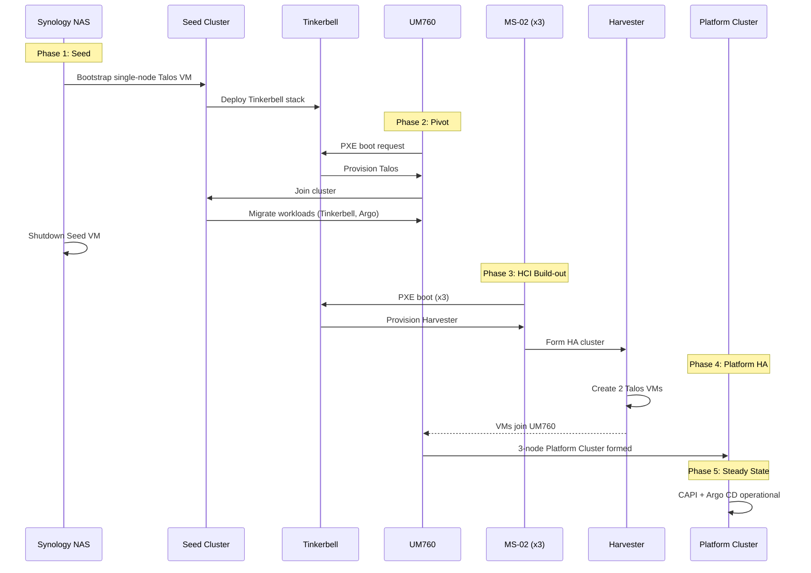
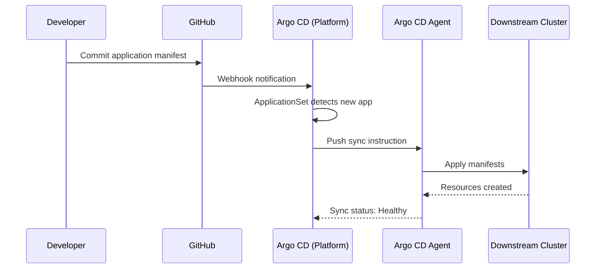

# 06. Runtime View

This section describes key runtime scenarios — how the system's building blocks interact during critical operations.

---

## 1. Genesis Bootstrap

The "Genesis" sequence bootstraps the entire infrastructure from bare metal to a fully operational Platform Cluster.

### Prerequisites
- Physical hardware cabled and powered
- VyOS gateway configured with VLANs and DHCP
- Synology NAS available with Talos VM capability

### Sequence



### Phase Summary

| Phase | Action | Result |
|:---|:---|:---|
| **1. Seed** | Bootstrap temporary Talos on NAS | Tinkerbell operational |
| **2. Pivot** | Provision UM760, migrate from NAS | Seed on physical hardware |
| **3. HCI** | Provision 3x MS-02 with Harvester | HCI cluster ready |
| **4. Platform HA** | Add 2 Harvester VMs to UM760 | 3-node HA Platform Cluster |
| **5. Steady State** | CAPI and Argo CD take over | Self-sustaining infrastructure |

---

## 2. Cluster Lifecycle

Downstream clusters are created, scaled, and destroyed declaratively via Git.

### Create Cluster


### Scale Cluster


### Delete Cluster


---

## 3. GitOps Sync Flow

All configuration changes flow through Git. This is the standard path for deploying or updating workloads.

### Application Deployment



### Sync Modes

| Mode | Description |
|:---|:---|
| **Auto-Sync** | Argo automatically applies changes on Git commit |
| **Manual Sync** | Operator triggers sync via UI/CLI (for sensitive changes) |
| **Prune** | Argo deletes resources removed from Git |
| **Self-Heal** | Argo reverts manual cluster changes to match Git |

### Drift Detection

```
┌─────────────────┐       ┌─────────────────┐
│     GitHub      │       │    Argo CD      │
│  (Desired State)│◀─────▶│ (Reconciler)    │
└─────────────────┘       └────────┬────────┘
                                   │ Compare
                                   ▼
                          ┌─────────────────┐
                          │   Cluster       │
                          │ (Actual State)  │
                          └─────────────────┘
                                   │
                          Drift? ──┼── Yes → Auto-correct
                                   └── No  → Healthy
```

If drift is detected (manual `kubectl` changes), Argo CD can:
- **Alert**: Notify operator of out-of-sync state
- **Self-Heal**: Automatically revert to Git state (if enabled)
