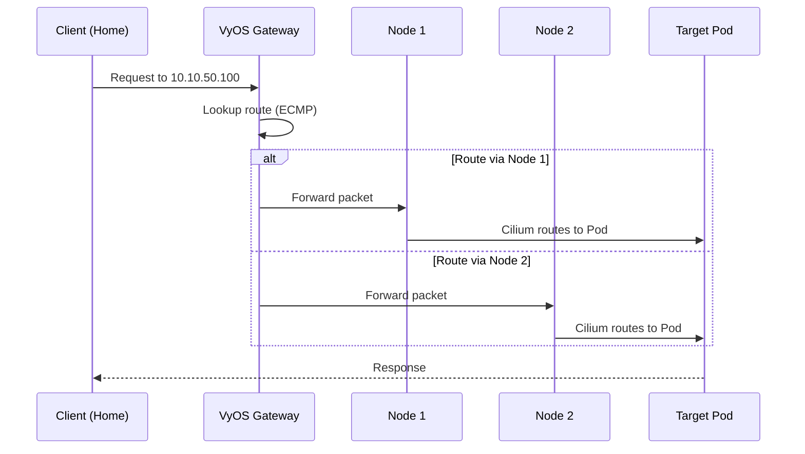

# 08. Concepts - Load Balancing

## Overview
Kubernetes `LoadBalancer` services require a mechanism to announce Service VIPs externally. This architecture uses **BGP (Border Gateway Protocol)** to advertise VIPs from cluster nodes to the VyOS gateway, enabling true load balancing and instant failover.

> [!IMPORTANT]
> **Design Decision**: This architecture implements **BGP-based load balancing** via Cilium (See [ADR 001](../09_design_decisions/001_use_bgp_loadbalancing.md)).

---

## Why BGP?

| Approach | Mechanism | Limitations |
|:---|:---|:---|
| **Layer 2 (ARP)** | Single node responds to ARP for VIP | Bottleneck (one node), slow failover |
| **BGP (Layer 3)** | All nodes announce VIP routes | True ECMP load balancing, instant failover |

BGP advantages for this architecture:
1. **ECMP Distribution**: VyOS routes traffic to all healthy nodes simultaneously
2. **Instant Failover**: BGP session teardown removes routes immediately (no ARP cache delays)
3. **Subnet Flexibility**: VIPs exist in a "floating" range (`10.10.50.0/24`) not tied to node interfaces

---

## Architecture

### BGP Peering Topology

```
┌───────────────────────────────────────────────────────────────┐
│                         VyOS Gateway                          │
│                        AS 64512                               │
│                   BGP Router Reflector                        │
└───────────────────────────┬───────────────────────────────────┘
                            │ ECMP Routes
        ┌───────────────────┼───────────────────┐
        │                   │                   │
        ▼                   ▼                   ▼
   ┌─────────┐         ┌─────────┐         ┌─────────┐
   │  Node 1 │         │  Node 2 │         │  Node 3 │
   │ AS 64513│         │ AS 64513│         │ AS 64513│
   │ Cilium  │         │ Cilium  │         │ Cilium  │
   └─────────┘         └─────────┘         └─────────┘
        │                   │                   │
        └───────────────────┴───────────────────┘
                Announce: 10.10.50.x/32
```

### Addressing

| Type | Range | Description |
|:---|:---|:---|
| **Node IPs** | `10.10.30.x/24` or `10.10.40.x/24` | Physical/VM connectivity |
| **Service VIPs** | `10.10.50.0/24` | LoadBalancer endpoints (VLAN 50) |

The VIP subnet is not assigned to any VyOS interface — routes are learned dynamically via BGP.

---

## Implementation

### Cilium BGP Configuration

Cilium provides integrated BGP support, eliminating the need for a separate MetalLB deployment:

```yaml
# CiliumBGPPeeringPolicy
apiVersion: cilium.io/v2alpha1
kind: CiliumBGPPeeringPolicy
metadata:
  name: vyos-peering
spec:
  nodeSelector:
    matchLabels:
      bgp: enabled
  virtualRouters:
    - localASN: 64513
      exportPodCIDR: false
      neighbors:
        - peerAddress: 10.10.30.1/32
          peerASN: 64512
      serviceSelector:
        matchExpressions:
          - key: app
            operator: Exists
```

### VyOS BGP Configuration

```bash
# VyOS BGP peer configuration
set protocols bgp 64512 parameters router-id '10.10.10.1'

# Dynamic neighbor (accepts any peer in range)
set protocols bgp 64512 neighbor 10.10.30.0/24 remote-as '64513'
set protocols bgp 64512 neighbor 10.10.40.0/24 remote-as '64513'

# Enable ECMP
set protocols bgp 64512 maximum-paths ebgp '8'
```

---

## Traffic Flow

### Request Path



### Failover Behavior

| Event | VyOS Action | Recovery Time |
|:---|:---|:---|
| Node becomes unhealthy | BGP session drops | < 3 seconds |
| VyOS removes route | Traffic stops to failed node | Immediate |
| Remaining nodes continue | ECMP rebalances | Seamless |

---

## Harvester Consideration

The Harvester Cloud Provider (HCP) includes its own LoadBalancer implementation using Layer 2. This architecture **bypasses HCP LoadBalancer** in favor of Cilium BGP:

| Approach | Path | Performance |
|:---|:---|:---|
| HCP LoadBalancer | Client → Harvester → VM | Software routing overhead |
| Cilium BGP | Client → VyOS → VM NIC | Direct routing, lower latency |

By using Cilium BGP, traffic flows directly from VyOS to the VM NIC without passing through Harvester's software router.
