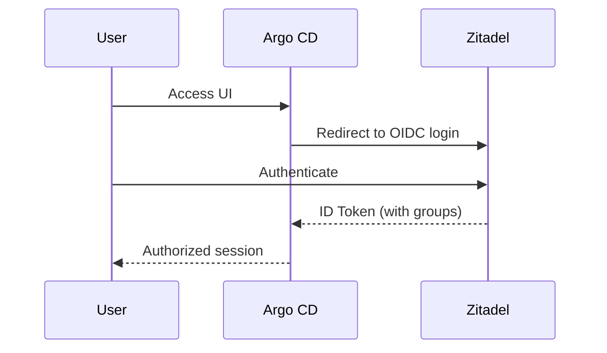
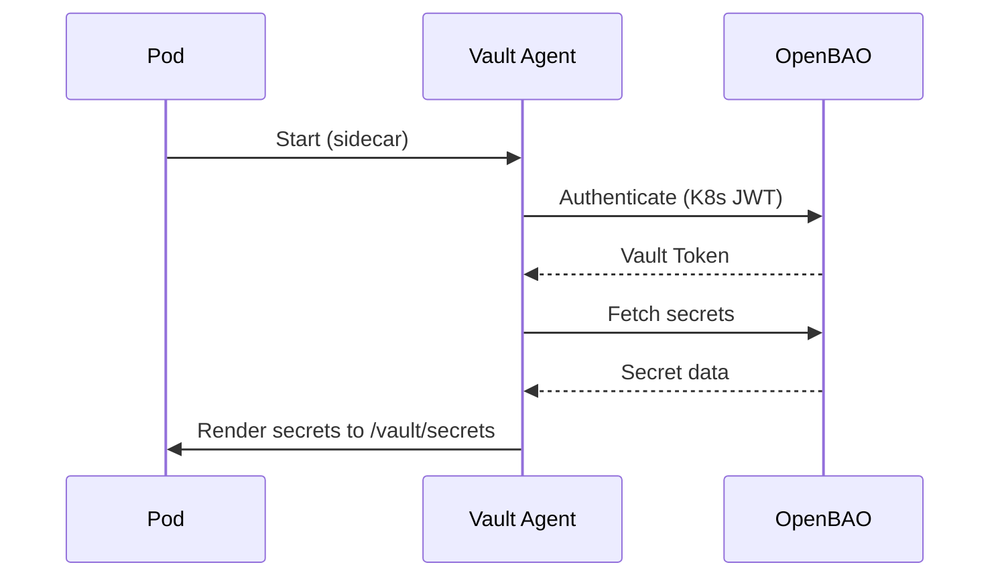

# 08. Concepts - Secrets and Identity

## Overview
Centralized **Identity** and **Secrets Management** are foundational platform services. Rather than each cluster managing its own authentication and secrets, these responsibilities are consolidated on the Platform Cluster and consumed by downstream clusters.

---

## Identity: Zitadel

**Zitadel** provides centralized identity management with OIDC/SAML support.

### Role

| Function | Description |
|:---|:---|
| **User Authentication** | SSO for platform UIs (Argo CD, Grafana, Harvester) |
| **Service Authentication** | OIDC tokens for machine-to-machine auth |
| **Multi-Tenancy** | Organizations/projects for logical separation |

### Integration Points

| Consumer | Integration |
|:---|:---|
| **Argo CD** | OIDC login, RBAC group mapping |
| **Grafana** | OIDC login |
| **Kubernetes** | OIDC for `kubectl` authentication |
| **Harvester** | OIDC login (via Rancher) |

### Architecture

```
┌─────────────────────────────────────────────────────────────────┐
│                      Platform Cluster                           │
│  ┌─────────────────────────────────────────────────────────┐    │
│  │                      Zitadel                            │    │
│  │   ┌──────────┐  ┌──────────┐  ┌──────────────────────┐  │    │
│  │   │  Users   │  │  Apps    │  │  Service Accounts    │  │    │
│  │   └──────────┘  └──────────┘  └──────────────────────┘  │    │
│  └─────────────────────────────────────────────────────────┘    │
└─────────────────────────────────────────────────────────────────┘
                              │
                    OIDC / SAML Tokens
                              │
         ┌────────────────────┼────────────────────┐
         ▼                    ▼                    ▼
    ┌─────────┐          ┌─────────┐          ┌─────────┐
    │ Argo CD │          │ Grafana │          │ kubectl │
    └─────────┘          └─────────┘          └─────────┘
```

### Access
- **UI**: `https://idm.lab.local`
- **OIDC Issuer**: `https://idm.lab.local`

---

## Secrets: OpenBAO

**OpenBAO** (HashiCorp Vault fork) provides centralized secrets management, PKI, and dynamic credentials.

### Capabilities

| Capability | Use Case |
|:---|:---|
| **Static Secrets** | API keys, passwords, tokens |
| **Dynamic Secrets** | Short-lived database credentials |
| **PKI** | TLS certificate issuance (internal CA) |
| **Transit** | Encryption as a service |

### Architecture

```
┌─────────────────────────────────────────────────────────────────┐
│                      Platform Cluster                           │
│  ┌─────────────────────────────────────────────────────────┐    │
│  │                      OpenBAO                            │    │
│  │   ┌────────────┐  ┌────────────┐  ┌────────────────┐    │    │
│  │   │  KV Store  │  │    PKI     │  │  Auth Methods  │    │    │
│  │   │  (secrets) │  │   (certs)  │  │ (K8s, OIDC)    │    │    │
│  │   └────────────┘  └────────────┘  └────────────────┘    │    │
│  └─────────────────────────────────────────────────────────┘    │
└─────────────────────────────────────────────────────────────────┘
                              │
                    Vault Agent Sidecar
                              │
         ┌────────────────────┼────────────────────┐
         ▼                    ▼                    ▼
    ┌─────────┐          ┌─────────┐          ┌─────────┐
    │ Cluster │          │ Cluster │          │ Cluster │
    │  media  │          │   dev   │          │  prod   │
    └─────────┘          └─────────┘          └─────────┘
```

### Secret Delivery: Vault Agent

Downstream clusters consume secrets via **Vault Agent**:

1. **Sidecar Injection**: Vault Agent runs as a sidecar in application pods
2. **Authentication**: Agent authenticates to OpenBAO using Kubernetes auth
3. **Secret Fetch**: Agent retrieves secrets and renders them to a shared volume
4. **Rotation**: Agent watches for secret changes and re-renders automatically

```yaml
# Example: Pod with Vault Agent annotations
apiVersion: v1
kind: Pod
metadata:
  annotations:
    vault.hashicorp.com/agent-inject: "true"
    vault.hashicorp.com/role: "app-role"
    vault.hashicorp.com/agent-inject-secret-db: "secret/data/db-creds"
```

### PKI: Internal Certificate Authority

OpenBAO hosts an internal CA for TLS certificates:

| Certificate Type | Use Case |
|:---|:---|
| **Ingress TLS** | HTTPS for internal services |
| **mTLS** | Service mesh / inter-service auth |
| **Talos Machine Certs** | (Optional) Node identity |

Integration with **cert-manager**:
```
cert-manager ──▶ OpenBAO PKI ──▶ Certificate issued
```

### Access
- **UI**: `https://vault.lab.local`
- **API**: `https://vault.lab.local/v1/`

---

## Authentication Flow

### User → Platform Service



### Application → Secret


