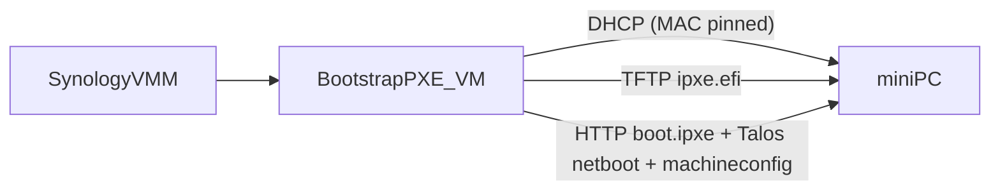

## Bootstrap PXE VM (Talos → mini-PC)

This module builds a **temporary, self-contained PXE appliance VM** intended to bring the lab’s “bootstrap mini-PC” online (Talos) *without* relying on the normal provisioning agent/Tinkerbell.

The output is a **RAW** Ubuntu VM disk that you import into Synology VMM and boot on a **physically isolated NAS↔mini-PC link**. Once booted, the VM provides:

- **DHCP** (only for the target mini-PC MAC)
- **TFTP** (UEFI iPXE binary)
- **HTTP** (Talos kernel/initramfs + Talos machineconfig + iPXE script)

### Architecture



### Network assumptions

Default addressing (can be overridden via Packer vars):

- **Bootstrap VM**: `10.10.10.2/24`
- **mini-PC lease**: `10.10.10.100`
- **DHCP range** (unused for non-target clients due to ignore rule): `10.10.10.50-10.10.10.60`

The VM’s IP is configured via netplan but **not applied during the Packer build** (so Packer can still SSH during image creation). It takes effect on first boot after import.

#### Outbound internet for image pulls

Talos will pull container images during startup (e.g. Kubernetes components). On a truly isolated link, you have two viable options:

- **Provide an uplink NIC and NAT through the appliance (recommended default)**:
  - Add a **second NIC** on the bootstrap appliance connected to a network with internet.
  - Keep **dnsmasq bound to the isolated NIC only** (`bind-interfaces`), so DHCP never touches the uplink.
  - The appliance will NAT traffic from the isolated NIC out via the uplink and provide DNS to the Talos node.

- **Stay fully offline**:
  - Host a registry/mirror on the appliance and configure Talos `machine.registries` to pull from it.
  - This is more work but is the only approach if the Talos node has no path to the internet at all.

### Security note (machineconfig)

You selected “serve machineconfig,” which typically embeds cluster secrets. Treat:

- The built VM image, and
- `provisioning/bootstrap/config/controlplane.yaml`
- `provisioning/bootstrap/config/talosconfig`

as **sensitive**. Only use this appliance on a **temporary, physically isolated** network.

## Repo layout

- `packer/bootstrap.pkr.hcl`: Packer QEMU template producing RAW disk image
- `packer/http/{meta-data,user-data}`: Ubuntu autoinstall seed (nocloud-net)
- `files/dnsmasq.conf`: dnsmasq template (rendered during build)
- `files/boot.ipxe`: iPXE script template (rendered during build)
- `files/nginx-bootstrap.conf`: nginx site serving `/srv/http`
- `scripts/extract-talos-netboot.sh`: extracts Talos `vmlinuz` + `initramfs.xz` from the ISO
- `config/controlplane.yaml`: SOPS-encrypted Talos machineconfig to be served to the mini-PC
- `config/talosconfig`: SOPS-encrypted Talos client config (optional convenience)
- `build.sh`: local build helper (build → gzip → optional upload)

## Build/run procedure

### 1) Ensure Talos ISO exists locally

This repo’s existing artifacts convention is:

- `artifacts/talos/<talos_version>/metal-amd64.iso`

Fetch it using the existing pipeline script:

```bash
cd /home/josh/code/lab
./scripts/download-iso.py talos v1.11.6
```

### 2) Provide the mini-PC machineconfig + talosconfig (SOPS-encrypted)

You can keep the generated Talos artifacts in git, encrypted with SOPS:

- `provisioning/bootstrap/config/controlplane.yaml` (machineconfig)
- `provisioning/bootstrap/config/talosconfig` (talosctl client config; optional convenience)

`build.sh` will decrypt these into `build/bootstrap/` and pass the plaintext paths to Packer.

### 3) Build the RAW image

```bash
cd /home/josh/code/lab
provisioning/bootstrap/build.sh v1.11.6 2025-12-17 00:11:22:33:44:55
```

This writes (by default, uncompressed):

- `artifacts/bootstrap/2025-12-17/bootstrap-pxe.raw`

If you want to publish/upload, set `COMPRESS=true` (or `UPLOAD=true`) to produce `bootstrap-pxe.raw.gz`.

### 4) Upload to iDrive e2 (optional)

The build helper can upload using `scripts/upload-artifacts.py` if you set `UPLOAD=true` and the usual iDrive env vars:

```bash
export IDRIVE_BUCKET=provisioning
export IDRIVE_ENDPOINT=s3.us-west-1.idrivee2.com
export IDRIVE_REGION=us-west-1
export IDRIVE_ACCESS_KEY=...
export IDRIVE_SECRET_KEY=...
export UPLOAD=true

cd /home/josh/code/lab
provisioning/bootstrap/build.sh v1.11.6 2025-12-17 00:11:22:33:44:55
```

This uploads the directory `artifacts/bootstrap/<bootstrap_version>/` to:

- `s3://<bucket>/bootstrap/<bootstrap_version>/`

## Synology VMM runbook

- Ensure Cloud Sync has pulled `bootstrap-pxe.raw` to the NAS.
  - If you published a compressed artifact instead: decompress (`gunzip bootstrap-pxe.raw.gz`) since VMM typically wants raw, not gz.
- Import the RAW as a VM disk in Synology VMM.
- Attach **NIC 1** to the **isolated NAS↔mini-PC link** network (PXE side).
- (Recommended) Attach **NIC 2** to a normal network with internet (uplink side). DHCP will not be served on this NIC.
- Boot the VM.
- Power on the mini-PC with **UEFI PXE enabled**.

Expected flow:

1. mini-PC gets DHCP (only if MAC matches).
2. mini-PC downloads `ipxe.efi` over TFTP.
3. iPXE fetches `http://10.10.10.2/boot.ipxe`.
4. iPXE boots Talos kernel/initramfs from the VM’s HTTP server and passes `talos.config=http://10.10.10.2/configs/minipc.yaml`.

Optional convenience:

- `http://10.10.10.2/configs/talosconfig` is served if you provided `config/talosconfig`.

## Troubleshooting

- **No DHCP offer**: confirm the mini-PC MAC matches the Packer var `minipc_mac`. dnsmasq is configured to ignore all other clients.
- **TFTP not working**: confirm `ipxe.efi` exists in `/srv/tftp/` inside the VM.
- **boot.ipxe not fetched**: confirm nginx is up and serving `/srv/http`.
- **Talos doesn’t boot**: verify the Talos ISO actually contains `vmlinuz` and `initramfs.xz` and that they extracted into `/srv/http/talos/<version>/`.
- **Talos config not applied**: confirm `configs/minipc.yaml` is valid and reachable over HTTP.
