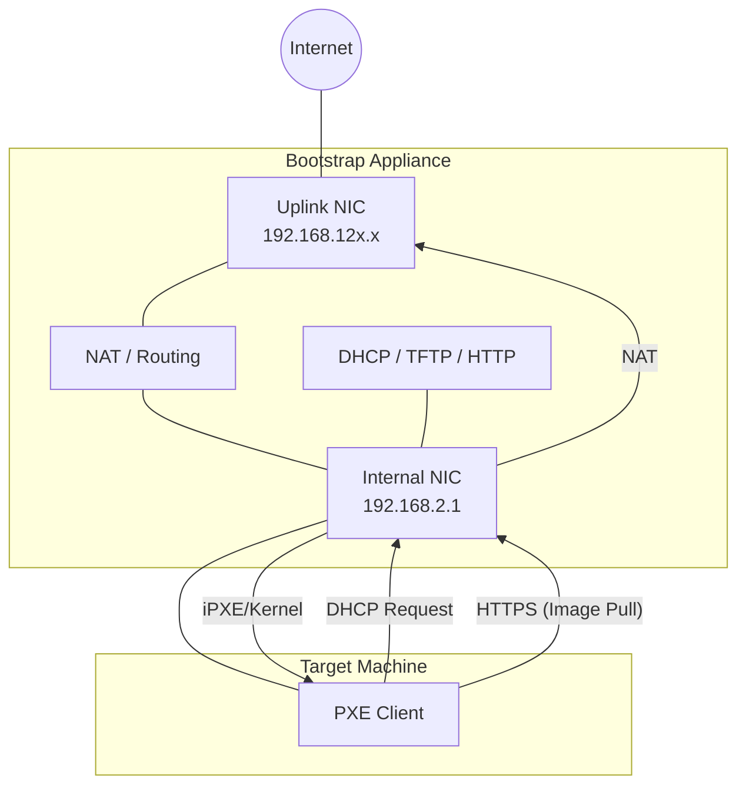

# Bootstrap PXE Appliance

This directory contains resources to build a **Bootstrap PXE Appliance VM**. This appliance is a temporary infrastructure component designed to bring a bare-metal machine (Mini-PC) online by network-booting (PXE) and installing Talos Linux.

It is intended for the initial "bootstrap" phase where no other infrastructure (specifically a permanent Tinkerbell instance running in the Talos cluster) exists yet.

## Directory Structure

- **`build.sh`**: The main build script that orchestrates the Packer build, handles SOPS decryption, and manages artifacts.
- **`config/`**: Contains the **SOPS-encrypted** Talos `machineconfig` and `talosconfig` served to the target machine.
- **`files/`**: Configuration files for the appliance services:
  - `dnsmasq.conf`: DHCP and TFTP configuration.
  - `nginx-bootstrap.conf`: HTTP server for Talos artifacts.
  - `boot.ipxe`: iPXE boot script.
  - `bootstrap-nat.sh`: NAT setup script.
- **`integration/`**: Libvirt-based integration tests to verify the appliance works before deployment. See [integration/README.md](integration/README.md).
- **`packer/`**: Packer template (`bootstrap.pkr.hcl`) used to build the VM image.

## Prerequisites

To build and test the appliance, you need:

- **Packer**: To build the VM image.
- **QEMU / KVM**: Hypervisor for running the VM.
- **OVMF**: UEFI firmware for QEMU (often provided by `ovmf` or `edk2-ovmf` packages).
- **uv**: Python package manager (checked by `justfile` and `integration` tests).
- **SOPS**: Required if using encrypted configurations in `config/`.

## Usage

Reference the `justfile` for common commands.

### Build

Build the appliance as a raw disk image (`bootstrap-pxe.raw`). The output artifact is placed in `artifacts/bootstrap/<version>/`.

```bash
just build
```

### Integration Test

Run the full integration test suite. This spawns the appliance and a client VM in a secluded Libvirt network to verify the PXE boot and Talos installation process.

```bash
just test
```

For more details on testing variables and debugging, see [integration/README.md](integration/README.md).

## Architecture



The appliance functions as a self-contained network boot server providing:

- **DHCP/TFTP** (`dnsmasq`): Assigns an IP to the target and serves the iPXE bootloader.
- **HTTP** (`nginx`): Serves the Talos kernel (`vmlinuz`), initramfs, and configuration files.
- **NAT**: The appliance routes traffic from the isolated PXE network to its upstream WAN interface, allowing the target machine to pull container images from the internet during installation.
